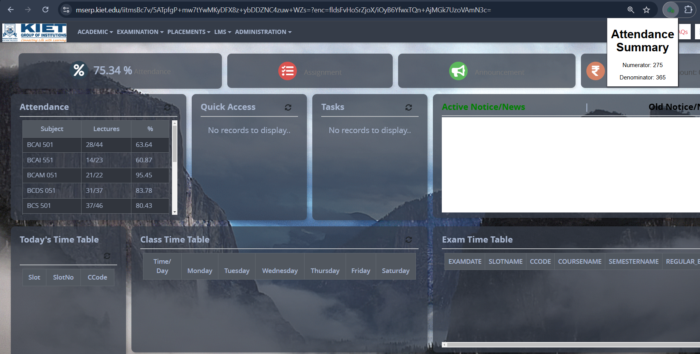

# **KIET ERP Attendance Extension**

This browser extension allows seamless scraping and analysis of attendance data from the KIET MSERP website. It provides quick insights into the number of classes attended and total classes held.

---

## **Features**
- **Efficient Data Retrieval**: Automatically fetch attendance details with a single click.
- **Detailed Analysis**: Displays total classes attended (numerator) and total classes held (denominator).
- **User-Friendly**: Simplified installation and usage.

---

## **Usage Guide**

### **Step 1: Log in to the MSERP KIET Website**
1. Visit the official [MSERP KIET Website](https://mserp.kiet.edu).
2. Log in with your credentials.  
   

---

### **Step 2: Scrape Attendance Data**
1. Navigate to the **Attendance** section on the MSERP website.
2. Reload the page for updated data.
3. Click on the extension icon in your browser toolbar.  
   The extension will display your attendance as:
   - **Numerator**: Total classes attended.
   - **Denominator**: Total classes held.  
   

---

## **Installation Steps**
To install the extension as an unpacked Chrome extension:

1. Download the latest version of the extension from the link below.  
2. Extract the downloaded `.zip` file.  
3. Open Chrome and navigate to:  
   **`chrome://extensions/`**
4. Enable **Developer Mode** using the toggle in the top-right corner.  
5. Click on **Load Unpacked** and select the unzipped folder.  
6. The extension will now be visible in your Chrome toolbar.

---

## **Download**
Click the link below to download the latest version of the extension:

- [**Download v1.0.0**](https://github.com/SaxenaPrashast/KIET_erp_Attendance/releases/download/v1.0.0/attendance-scraper-v1.0.0.zip)

---
